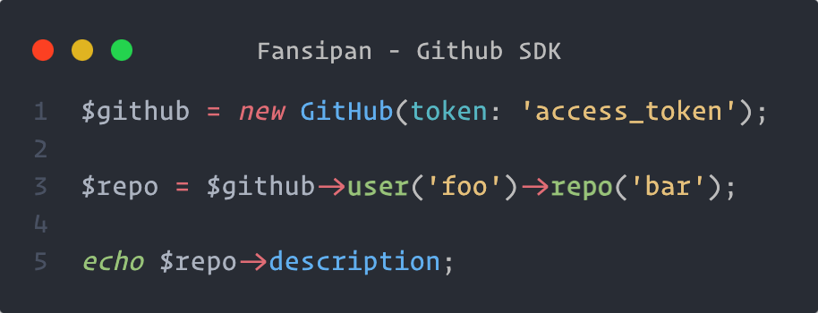

## Creating SDK Connector

```php
use Fansipan\Authenticator\BearerAuthenticator;
use Fansipan\Contracts\ConnectorInterface;
use Fansipan\Middleware\Authentication;
use Fansipan\Middleware\Interceptor;
use Fansipan\Traits\ConnectorTrait;
use Psr\Http\Message\RequestInterface;

final class Github implements ConnectorInterface
{
    use ConnectorTrait;

    private $token;

    private $version;

    public function __construct(string $token, ?string $version = null)
    {
        $this->token = $token;
        $this->version = $version;
    }

    public static function baseUri(): ?string
    {
        return 'https://api.github.com';
    }

    /**
     * Get default middleware.
     */
    protected function defaultMiddleware(): array
    {
        return [
            Interceptor::request(function (RequestInterface $request) {
                if ($this->version) {
                    $request = $request->withHeader('X-GitHub-Api-Version', $this->version);
                }

                return $request->withHeader('Accept', 'application/vnd.github+json');
            }),
            new Authentication(new BearerAuthenticator($this->token)),
        ];
    }
}
```

### Using Connector

Now that we have created the SDK connector class, all we need to do is instansiate it and provide the API authentication token.

```php
$github = new Github('access-token');

// Ready to make request
```

## Sending request

When you have created the request, all that developers would need to do is to instantiate and send the request on the connector.

```php
use Fansipan\Middleware\Auth\BearerAuthentication;

final class GetRepository extends Request
{
    private $owner;

    private $repo;

    public function __construct(string $owner, string $repo)
    {
        $this->owner = $owner;
        $this->repo = $repo;
    }

    public function endpoint(): string
    {
        return sprintf('/repos/%s/%s', $this->owner, $this->repo);
    }
}
```

```php
$github = new Github('access-token');

// Send a request straight away.
$github->send(new GetRepository('phanxipang', 'fansipan'));

// Or if you would like to do something with the request before sending it.
$request = new GetRepository('phanxipang', 'fansipan');
$request->headers()->with('X-Foo', 'baz');

$response = $connector->send($request);
```

With this method, it’s really simple to build your SDK. All you would need to do is create all the requests and then document them in your `README`. Developers using your SDK can just instantiate your SDK and then use the `send` methods.

### Sending Requests With Methods

Sometimes you may want to make it easy for the developer to find all the methods that they need to call the API through your SDK. You can create methods on your connector which send an API request or you could write a "resource" class that contains lots of requests.

+++ Definition
```php
use Fansipan\Middleware\Authentication;
use Fansipan\Middleware\Interceptor;

final class Github implements ConnectorInterface
{
    use ConnectorTrait;

    // { ... }

    public function allUserRepos(string $name, int $page = 1): Response
    {
        return $this->send(new GetUserRepositories($name, $page));
    }
}
```
+++ Usage
```php
$github = new Github('access-token');

$github->allUserRepos('jenky');
```
+++

## Using Request Resources

The resource pattern can help you combine your SDK requests into simple groups that are easy for the developer to find and consume. The tutorial below will guide you through creating a resource class however you should customise it to your SDK.

### Creating a Resource

Let's start by creating a `OrganizationResource` class. This class should contain a constructor that passes in an instance of `Fansipan\Contracts\ConnectorInterface` and additional constructor arguments that you need for all request grouped under the resource.

```php
<?php

use Fansipan\Request;

final class OrganizationResource
{
    private ConnectorInterface $connector;

    private string $org;

    public function __construct(ConnectorInterface $connector, string $org)
    {
        $this->connector = $connector;
        $this->org = $org;
    }

    public function repos(int $page = 1): Response
    {
        return $this->connector->send(new GetRepositories($this->org, $page));
    }

    public function repo(string $repo): Response
    {
        return $this->connector->send(new GetRepository($this->org, $repo));
    }
}
```

### Defining a Resource On Your Connector

Now we'll define a method on the connector which returns this resource class. Don't forget to pass the connector's instance (`$this`) into the resource.

```php
<?php

use Fansipan\Traits\ConnectorTrait;
use Fansipan\Traits\ConnectorTrait;
use Fansipan\Traits\ConnectorTrait;
use Psr\Http\Message\RequestInterface;


final class Github implements ConnectorInterface
{
    use ConnectorTrait;

    // { ... }

    public function org(string $org): OrganizationResource
    {
        return new OrganizationResource($this, $org);
    }
}
```

### Using the Resource

Now all our users have to do is access the `org()` method on the SDK class to get access to all the various requests that our SDK has to offer.

```php
<?php

$github = new Github('access-token');

$repos = $github->org('github')->repos();

$docs = $github->org('github')->repo('docs');
```

## SDK Generator

[Mist](https://github.com/phanxipang/mist) is a generation tool designed to automate the generation of SDKs based on the OpenAPI specification (OAS).

[!ref icon="cloud" target="blank" text="Mist"](https://github.com/phanxipang/mist)

The tool assists in generating code that establishes the basic foundation for interacting with an API based on the OpenAPI specification. This includes generating connector methods, request stubs, data models, and handling basic request/response functionality. However, it may not cover all possible use cases or provide all the advanced features required for a fully functional SDK.

It's important to note that while the Mist provides a starting point, developers will still need to review and modify the generated code according to their project's requirements, coding standards, and best practices. This customization process ensures that the SDK aligns with the specific needs of the application and the API being integrated.

!!!
As the tool is in the early alpha stage, it's essential to carefully evaluate its generated code and thoroughly test it to ensure it meets the desired functionality and quality standards before using it in a production environment.
!!!
