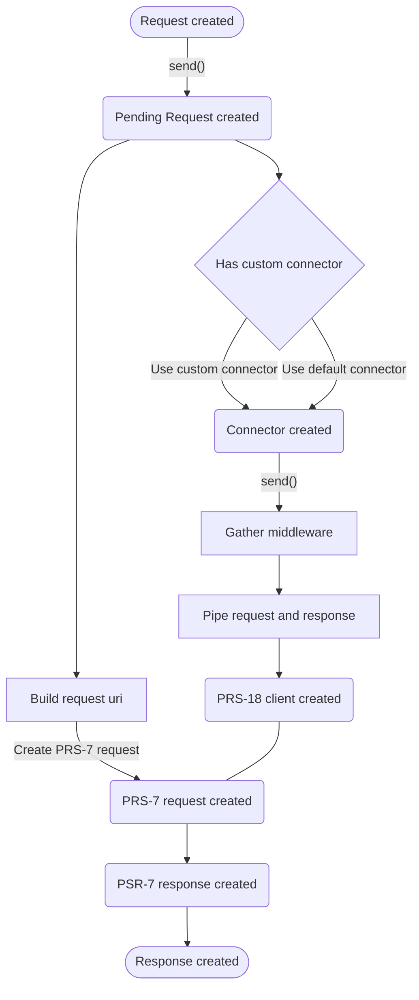

In this quickstart, we'll guide you through the most important functionalities of the package and how to use them.

First, you should [install the package](./installation.md).

## Flow Diagram



## Create a Connector

In order to send a request. First, you should create a `Connector` class that extends `Jenky\Atlas\Connector` class.

You may also set the request base uri by using `baseUri()` method. When a relative URI is provided to in request `endpoint()` method, the connector will combine the base URI with the relative URI using the rules described in [RFC 3986, section 5.2](https://www.rfc-editor.org/rfc/rfc3986#section-5.2).

```php
<?php

use Jenky\Atlas\Connector as BaseConnector;

class Connector extends BaseConnector
{
    public function baseUri(): ?string
    {
        return 'https://mydomain.com/api';
    }
}
```

## Create a Request

Let's say you want to send a request to `https://httpbin.org/headers`. Create `GetHeadersRequest` class that extends the `Jenky\Atlas\Request` abstract class and set the uri in `endpoint` public method. That's all.

```php
<?php

use Jenky\Atlas\Request;

class GetHeadersRequest extends Request
{
    public function endpoint(): string
    {
        return 'https://httpbin.org/headers';

        // If your connector has define base URI then it can be
        return '/headers';
    }
}
```

## Send the Request

Now you should be able to send the request:

```php
$connector = new Connector();
$request = new GetHeadersRequest();
$response = $connector->send($request);
```

## Inspect the response

The request above will return an instance of `Jenky\Atlas\Response`, which provides a variety of methods that may be used to inspect the response:

```php
if ($response->failed()) {
    return;
}

$data = $response->data();

// Perform your application logic.
```

You may wonder where is the client or how can I customize it? Be sure to explore the next chapter about [connectors](./../basic/connectors.md), [requests](./../basic/requests.md) and [responses](./../basic/responses.md) to find out more.
