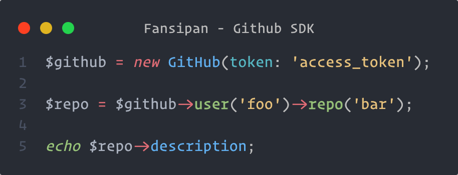

# Introduction

## Description

A simple package that allows you to write your API integrations or SDKs in a elegant way.

## Why?

Building API integrations can be a time-consuming task. Once you have selected an API client to work with, you encounter the challenge of managing numerous configurations. Additionally, reusing requests without resorting to copying and pasting can be difficult. It is common to find yourself writing repetitive boilerplate code repeatedly throughout the integration process.

Tools such as [PSR-7](https://www.php-fig.org/psr/psr-7), [PSR-17](https://www.php-fig.org/psr/psr-17) and [PSR-18](https://www.php-fig.org/psr/psr-18) are great to build your API integrations. The only missing piece is how to effectively connect them together in a structured and clean manner.

## Features

- Provides a simple, easy-to-learn, object-oriented syntax that standardizes the way you interact with APIs.
- Abstract API integrations into classes so you can keep your code tidy and centralized.
- Configuration is fast and can be shared across all your requests.
- [PSR](https://www.php-fig.org/psr) compliant.
- HTTP Client agnostic.
- Reuseable middleware.

## Credits

- [PHP-FIG](https://www.php-fig.org/) for their [PSRs](https://www.php-fig.org/psr/) with special recognition to the authors and contributors of [PSR-7 (HTTP message interfaces)](https://www.php-fig.org/psr/psr-7), [PSR-17 (HTTP Factories)](https://www.php-fig.org/psr/psr-17) and [PSR-18 (HTTP Client)](https://www.php-fig.org/psr/psr-18).
- [Guzzle](https://github.com/guzzle/guzzle) for their URI resolver and middleware concept.
- [Sam C](https://github.com/Sammyjo20) for his amazing [Saloon](https://github.com/saloonphp/saloon) package, which served as a source of inspiration.
- [HTTPlug Discovery](https://github.com/php-http/discovery).
